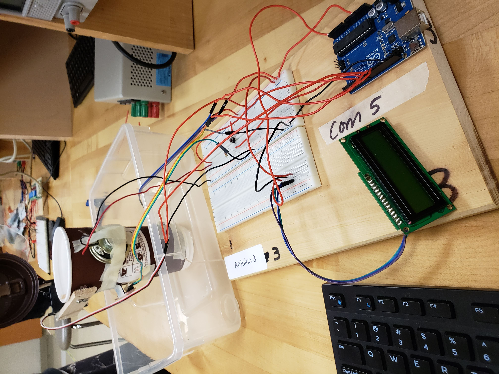
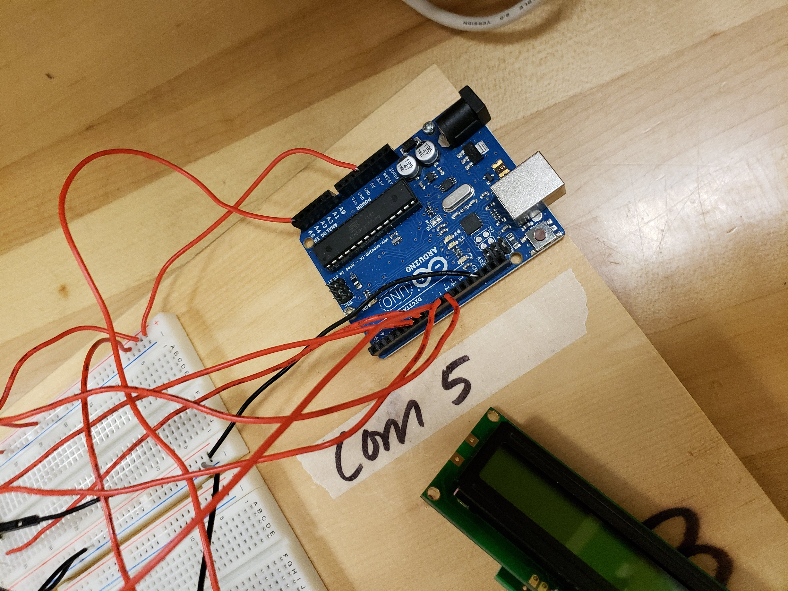
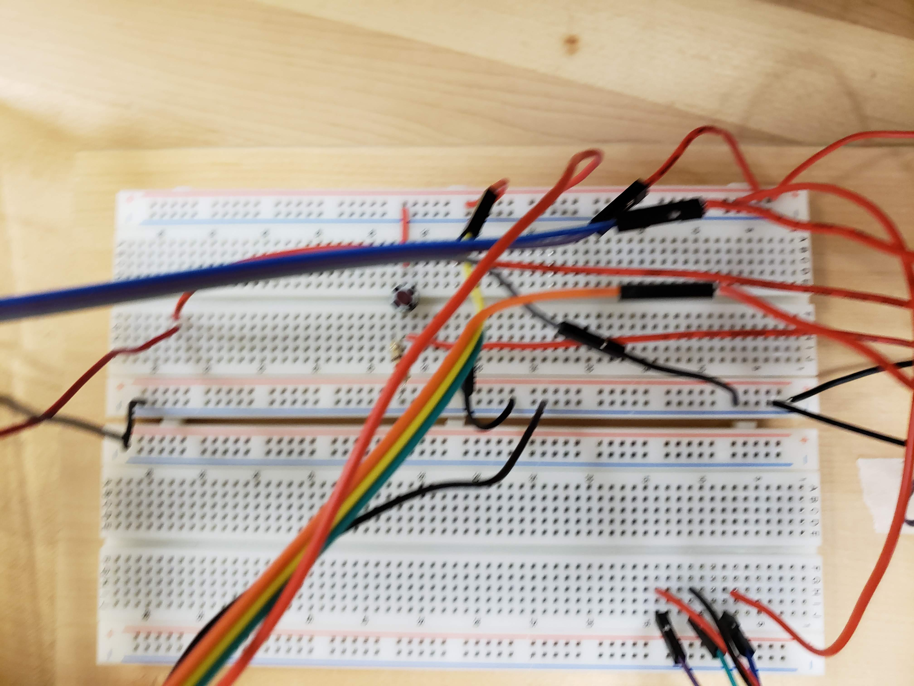

# Smart Coffee Mug, a project by Sathira Katugaha
## made in June 2018 as a fun project

#### Description:
This is a prototype smart coffee mug consisting of OneWire temperature, 
and touch sensors as well as Servo motors connected to an Arduino Uno 
microcontroller. 

#### Use:
When the user picks up the mug it will open the lid for the user and 
close when put down.
If the liquid is too hot the mug will open its lid to cool down and 
close after it has cooled down.
If the user tries to pick up the mug while hot a warning is sounded.

#### Purpose:
In my grade 12 Computer Engineering course, my teacher, Mr. Jeffery Laxton,
challenged me to make something I could sell without any of his help. He 
supplied me with the parts I needed and after a bit of researach I
decided to make something to help my fellow coffee addicts. Thus, my Smart
Coffee Mug prototype was born. Thoroughly impressed my teacher gave me a 
very high mark in that course.

#### Pictures:

# [CLICK FOR VIDEO](https://photos.app.goo.gl/tRgWN9vQT7WkQJzNA)
